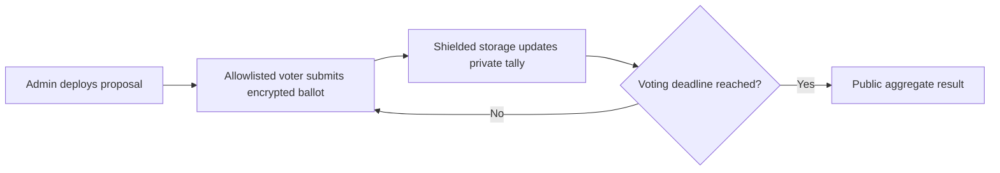

# VeilVote

> Secret-ballot governance built with Seismic's native on-chain privacy.

[](https://docs.seismic.systems/)
[](https://github.com/kejan2514/veil-vote/actions/workflows/contracts.yml)
[](LICENSE)

Public governance contracts leak the live vote count. That can create bandwagon
effects and makes voter choices easy to profile. VeilVote keeps each ballot and
the running tallies shielded while voting is open, then reveals only the final
aggregate result.

## Why it is different

```solidity
mapping(address => sbool) private hasVoted;
suint256 private votesFor;
suint256 private votesAgainst;
```

Seismic's `s`-prefixed types are stored in confidential storage. The contract
never emits the voter's choice, and observers cannot read interim totals. After
the deadline, anyone can call `results()` to reveal the aggregate outcome.

## Privacy lifecycle



## Features

- One-person, one-vote enforcement with shielded participation state
- Private `for` and `against` tallies during the voting window
- No vote-choice events or public getter leakage
- Optional voter allowlist managed before voting starts
- Explicit custom errors and lifecycle checks
- Foundry tests covering happy paths, access control, double voting and timing

## Quick start

### Prerequisites

Install Rust and the [Seismic development tools](https://docs.seismic.systems/getting-started/installation).

```bash
git clone --recurse-submodules https://github.com/kejan2514/veil-vote.git
cd veil-vote/contracts
sforge test -vv
```

### Deploy locally

```bash
sanvil
```

In another terminal:

```bash
cd contracts
export PRIVATE_KEY=<your-local-development-key>
sforge script script/DeployVeilVote.s.sol:DeployVeilVote \
  --rpc-url http://127.0.0.1:8545 --broadcast
```

Never use a production private key in an `.env` file committed to Git.

## Contract interface

| Function | Who | When | Privacy behavior |
| --- | --- | --- | --- |
| `addVoters(address[])` | Admin | Before voting | Eligibility is public |
| `vote(sbool)` | Eligible voter | During voting | Choice and tallies stay shielded |
| `results()` | Anyone | After voting | Reveals aggregate totals only |
| `outcome()` | Anyone | After voting | Reveals accepted/rejected/tied |

## Design decisions

Eligibility is intentionally public, while participation and ballot choice are
shielded. This makes the demo easy to audit without publishing how an eligible
address voted. Production governance may need stronger identity, delegation,
quorum and sybil-resistance mechanisms.

See [SECURITY.md](SECURITY.md) for the threat model and known limitations.

## Project structure

```text
contracts/
├── src/VeilVote.sol
├── test/VeilVote.t.sol
└── script/DeployVeilVote.s.sol
```

## Roadmap

- [ ] Seismic Viem client example with encrypted calldata
- [ ] Multi-proposal governor factory
- [ ] Token-weighted shielded voting
- [ ] End-to-end testnet deployment
- [ ] Independent security review

## Contributing

Issues and pull requests are welcome. Read [CONTRIBUTING.md](CONTRIBUTING.md)
before submitting a change.

## License

[MIT](LICENSE)
